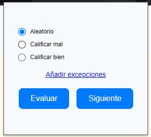
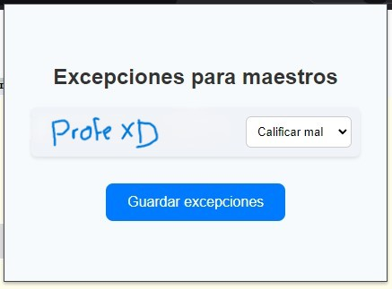

# Auto Teacher Evaluator
Simple Chrome extension to make ITCM's Teacher Evaluation faster

## Why?
Because I'm too lazy to spend 15 minutes to do the teacher evaluation but not for spend 3 hours to make this plugin.

## Requirements
Have any Chromium-based navigator (e.g Chrome, Brave, Edge, etc). Firefox and Safari aren't supported.

## Usage
### Main window
From this window you select the extension's behaviour of the extension to evaluate teachers. It has three modes:

- Random (Aleatorio)
- Bad grading (Calificar mal)
- Good grading (Calificar bien)

The two buttons (whose functionallity is described by their names) each have a shortcut. By default they're assigned as shown below:

- Shift + Ctrl + 1 -> Evaluate (Evaluar)
- Shift + Ctrl + 2 -> Next (Ir a la siguiente pregunta)
- Shift + Ctrl + 3 -> Evaluate + Next (Si)

#### Config Window (also known as: Exceptions or "Excepciones" para mi gente bonita)
This window allows you to customize grading behaviour for each teacher. When you open this window. By default, when you open this window, each teacher will have the same grading behaviour that you set in the main window.

## Installation
1. Download the latest build. You can get it here: 
2. Go to your navigator and search this URL: chrome://extensions/
3. Enable "Developer Mode" (Modo desarrollador) in the top right corner
4. Drag & drop the file `crx` (el archivo que descargó en el link que le di pues) file into the extensions window
